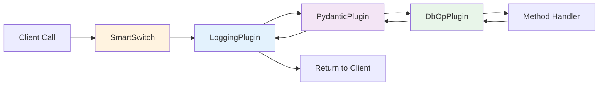
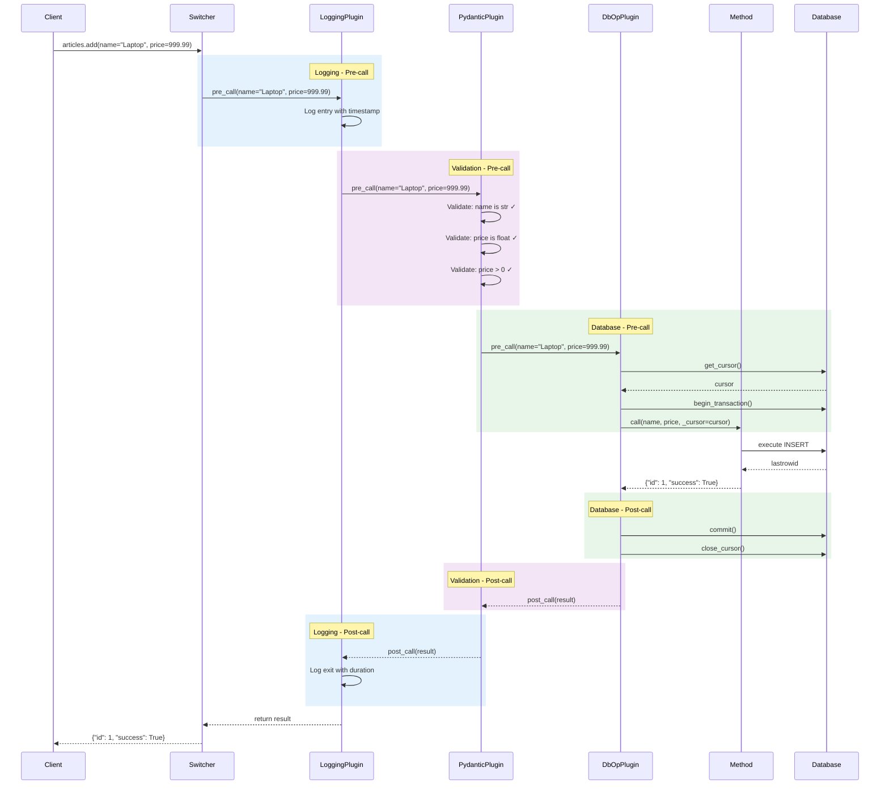
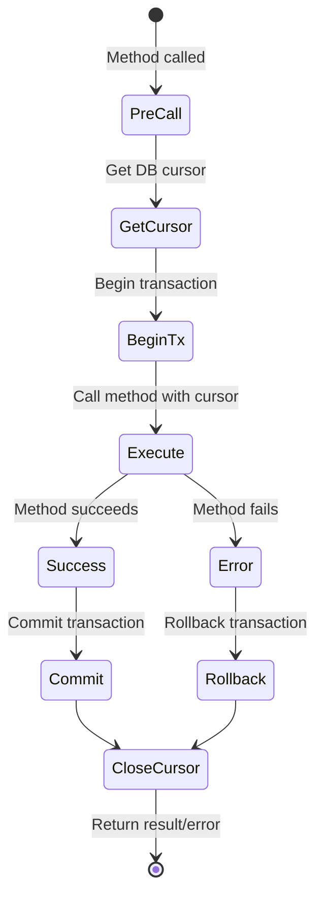

# SmartSwitch Integration

Sample Shop uses **[SmartSwitch](https://smartswitch.readthedocs.io)** for method dispatch with a **plugin chain** that provides logging, validation, and database cursor injection.

## Overview

SmartSwitch enables **aspect-oriented programming** by wrapping method calls with plugins that add cross-cutting concerns.



## The `dbop` Switcher

All table managers use a SmartSwitch instance named `dbop`:

```python
from smartswitch import Switcher
from sample_shop.sql.plugins import LoggingPlugin, PydanticPlugin, DbOpPlugin

class BaseTable:
    dbop = Switcher(
        prefix='',
        plugins=[
            LoggingPlugin(),
            PydanticPlugin(),
            DbOpPlugin()
        ]
    )

    @dbop
    def add(self, name: str, price: float, _cursor=None):
        """Add a record with automatic validation and transaction."""
        _cursor.execute(
            "INSERT INTO articles (name, price) VALUES (?, ?)",
            (name, price)
        )
        return {"id": _cursor.lastrowid}
```

## Plugin Chain Flow

When you call a method decorated with `@dbop`, it goes through the plugin chain:



## LoggingPlugin

**Purpose**: Log method calls, parameters, results, and execution time.

### Features

- Logs method entry with parameters
- Logs method exit with result
- Measures execution time
- Logs errors with stack trace

### Implementation

```python
class LoggingPlugin:
    def pre_call(self, context):
        """Log method entry."""
        logger.info(
            f"Calling {context.method_name}",
            params=context.kwargs
        )
        context.start_time = time.time()

    def post_call(self, context, result):
        """Log method exit."""
        duration = time.time() - context.start_time
        logger.info(
            f"Completed {context.method_name}",
            duration=duration,
            result=result
        )
        return result

    def on_error(self, context, error):
        """Log errors."""
        logger.error(
            f"Error in {context.method_name}",
            error=str(error),
            traceback=traceback.format_exc()
        )
        raise
```

### Example Log Output

```
INFO: Calling articles.add params={'name': 'Laptop', 'price': 999.99}
INFO: Completed articles.add duration=0.003s result={'id': 1, 'success': True}
```

## PydanticPlugin

**Purpose**: Validate and convert method parameters using type hints.

### Features

- Validates parameter types
- Converts values to correct types
- Validates constraints (min, max, regex, etc.)
- Provides clear error messages

### How It Works

The plugin uses method type hints to build a Pydantic model and validate parameters:

```python
@dbop
def add(self, name: str, price: float, quantity: int = 0, _cursor=None):
    # Pydantic automatically validates:
    # - name must be str
    # - price must be float
    # - quantity must be int, defaults to 0
    ...
```

### Validation Examples

**Type Conversion**:

```python
# Call with string "10" for int parameter
result = articles.add(name="Test", price=9.99, quantity="10")
# Pydantic converts "10" → 10 (int)
```

**Type Error**:

```python
# Call with invalid type
result = articles.add(name="Test", price="invalid")
# Raises ValidationError: value is not a valid float
```

**Constraint Validation**:

```python
from pydantic import Field

@dbop
def add(
    self,
    name: str = Field(min_length=1, max_length=100),
    price: float = Field(gt=0),
    quantity: int = Field(ge=0),
    _cursor=None
):
    """Add with constraints."""
    ...

# This fails validation
result = articles.add(name="", price=-10, quantity=-5)
# Raises ValidationError:
# - name: ensure this value has at least 1 characters
# - price: ensure this value is greater than 0
# - quantity: ensure this value is greater than or equal to 0
```

### Custom Validators

Add custom validation logic:

```python
from pydantic import validator

@dbop
def add(
    self,
    name: str,
    price: float,
    _cursor=None
):
    """Add with custom validation."""
    if price > 10000:
        raise ValueError("Price too high")
    ...
```

## DbOpPlugin

**Purpose**: Inject database cursor and manage transactions.

This is the **key plugin** that enables the data access pattern.

### Features

- Injects `_cursor` parameter into methods
- Begins transaction for write operations
- Commits on success
- Rollbacks on error
- Closes cursor automatically

### How It Works



### Implementation

```python
class DbOpPlugin:
    def pre_call(self, context):
        """Inject cursor before method call."""
        # Get cursor from database
        cursor = context.instance.db.adapter.get_cursor()
        context.cursor = cursor

        # Inject cursor into method
        context.kwargs['_cursor'] = cursor

        # Begin transaction for write operations
        if self._is_write_operation(context.method_name):
            context.instance.db.adapter.begin_transaction()

    def post_call(self, context, result):
        """Commit transaction after successful call."""
        if self._is_write_operation(context.method_name):
            context.instance.db.adapter.commit()

        # Close cursor
        context.instance.db.adapter.close_cursor(context.cursor)

        return result

    def on_error(self, context, error):
        """Rollback transaction on error."""
        if self._is_write_operation(context.method_name):
            context.instance.db.adapter.rollback()

        # Close cursor
        context.instance.db.adapter.close_cursor(context.cursor)

        raise

    def _is_write_operation(self, method_name):
        """Check if method modifies data."""
        return method_name in ('add', 'update', 'delete')
```

### Usage in Methods

The injected `_cursor` is used for all database operations:

```python
@dbop
def add(self, name: str, price: float, _cursor=None):
    """
    The _cursor parameter is automatically injected by DbOpPlugin.
    You don't pass it when calling the method.
    """
    # Use cursor for SQL operations
    _cursor.execute(
        "INSERT INTO articles (name, price) VALUES (?, ?)",
        (name, price)
    )

    # Access lastrowid
    article_id = _cursor.lastrowid

    return {"id": article_id, "success": True}

# Call WITHOUT _cursor parameter
result = articles.add(name="Laptop", price=999.99)
```

### Transaction Behavior

**Write Operations** (add, update, delete):

```python
@dbop
def add(self, name: str, _cursor=None):
    # Transaction begins automatically
    _cursor.execute("INSERT INTO ...")
    # If no error: transaction commits automatically
    # If error: transaction rollbacks automatically
    return result
```

**Read Operations** (list, count):

```python
@dbop
def list(self, _cursor=None):
    # No transaction (read-only)
    _cursor.execute("SELECT ...")
    # Cursor closed automatically
    return result
```

### Error Handling

```python
@dbop
def add(self, name: str, _cursor=None):
    try:
        _cursor.execute("INSERT INTO articles (name) VALUES (?)", (name,))
        return {"success": True}
    except IntegrityError:
        # Transaction will rollback automatically
        return {"success": False, "error": "Duplicate name"}
```

## Plugin Configuration

### Changing Plugin Order

Order matters! Plugins run in the order they're defined:

```python
# ✅ Correct order
dbop = Switcher(
    prefix='',
    plugins=[
        LoggingPlugin(),      # 1. Log first
        PydanticPlugin(),     # 2. Then validate
        DbOpPlugin()          # 3. Finally inject cursor
    ]
)

# ❌ Wrong order - validation after cursor injection
dbop = Switcher(
    prefix='',
    plugins=[
        DbOpPlugin(),         # Cursor injected first
        PydanticPlugin(),     # Validation on already-injected params
        LoggingPlugin()
    ]
)
```

### Adding Custom Plugins

Create your own plugin:

```python
class CachingPlugin:
    """Cache read operation results."""

    def __init__(self):
        self.cache = {}

    def pre_call(self, context):
        """Check cache before calling method."""
        if context.method_name == 'list':
            cache_key = self._make_key(context.kwargs)
            if cache_key in self.cache:
                # Return cached result (skip method call)
                return self.cache[cache_key]

    def post_call(self, context, result):
        """Cache result after successful call."""
        if context.method_name == 'list':
            cache_key = self._make_key(context.kwargs)
            self.cache[cache_key] = result
        return result

    def _make_key(self, kwargs):
        return str(sorted(kwargs.items()))

# Use in switcher
dbop = Switcher(
    prefix='',
    plugins=[
        LoggingPlugin(),
        PydanticPlugin(),
        CachingPlugin(),      # Add custom plugin
        DbOpPlugin()
    ]
)
```

## Performance Benefits

### Reduced Boilerplate

**Without SmartSwitch**:

```python
def add(self, name: str, price: float):
    # Manual validation
    if not isinstance(name, str):
        raise ValueError("name must be string")
    if not isinstance(price, (int, float)):
        raise ValueError("price must be number")
    if price <= 0:
        raise ValueError("price must be positive")

    # Manual logging
    logger.info(f"Adding article: {name}")
    start_time = time.time()

    # Manual transaction management
    cursor = None
    try:
        cursor = self.db.get_cursor()
        self.db.begin_transaction()

        cursor.execute(
            "INSERT INTO articles (name, price) VALUES (?, ?)",
            (name, price)
        )
        article_id = cursor.lastrowid

        self.db.commit()

        # Manual logging
        duration = time.time() - start_time
        logger.info(f"Added article in {duration}s")

        return {"id": article_id, "success": True}

    except Exception as e:
        if cursor:
            self.db.rollback()
        logger.error(f"Error adding article: {e}")
        raise

    finally:
        if cursor:
            self.db.close_cursor(cursor)
```

**With SmartSwitch**:

```python
@dbop
def add(self, name: str, price: float, _cursor=None):
    """Add article - validation, logging, and transaction automatic!"""
    _cursor.execute(
        "INSERT INTO articles (name, price) VALUES (?, ?)",
        (name, price)
    )
    return {"id": _cursor.lastrowid, "success": True}
```

### Consistency

All methods get the same:

- Validation logic
- Error handling
- Logging format
- Transaction management

No manual implementation means fewer bugs.

### Testability

Mock the plugins for testing:

```python
def test_add_without_database():
    """Test business logic without real database."""
    mock_cursor = Mock()
    mock_cursor.lastrowid = 42

    # Call method with mock cursor
    result = articles.add(name="Test", price=9.99, _cursor=mock_cursor)

    assert result["id"] == 42
    mock_cursor.execute.assert_called_once()
```

## Best Practices

### 1. Always Accept `_cursor` Parameter

```python
# ✅ Good
@dbop
def add(self, name: str, _cursor=None):
    _cursor.execute(...)

# ❌ Bad - plugin can't inject cursor
@dbop
def add(self, name: str):
    ...
```

### 2. Use Type Hints for Validation

```python
# ✅ Good - Pydantic validates automatically
@dbop
def add(self, name: str, price: float, _cursor=None):
    ...

# ❌ Bad - no validation
@dbop
def add(self, name, price, _cursor=None):
    ...
```

### 3. Let Plugin Handle Transactions

```python
# ✅ Good - plugin manages transaction
@dbop
def add(self, name: str, _cursor=None):
    _cursor.execute("INSERT ...")
    return {"success": True}

# ❌ Bad - manual transaction management
@dbop
def add(self, name: str, _cursor=None):
    self.db.begin_transaction()
    _cursor.execute("INSERT ...")
    self.db.commit()  # Plugin will commit again!
    return {"success": True}
```

### 4. Don't Mix Plugin and Manual Approaches

```python
# ❌ Bad - mixing approaches
@dbop
def add(self, name: str, _cursor=None):
    # Manual validation (plugin already did this!)
    if not isinstance(name, str):
        raise ValueError("Invalid name")

    # Manual logging (plugin already did this!)
    logger.info(f"Adding {name}")

    _cursor.execute("INSERT ...")
```

## Learn More

- [SmartSwitch Documentation](https://smartswitch.readthedocs.io) - Full SmartSwitch guide
- [Architecture](architecture.md) - How SmartSwitch fits in the system
- [Table Managers](table-managers.md) - See `@dbop` in action
- [Database System](database-system.md) - Understanding cursors and transactions

## Next Steps

- [Architecture](architecture.md) - Overall system design
- [Table Managers](table-managers.md) - CRUD operations with `@dbop`
- [Database System](database-system.md) - Database layer details
