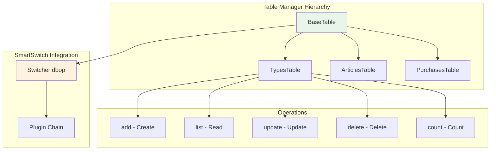

# Table Managers

Table managers provide **CRUD operations** (Create, Read, Update, Delete) with automatic validation, transaction management, and format support.

## Overview

Each table in Sample Shop has a dedicated manager class:



## BaseTable Class

All table managers inherit from `BaseTable`, which provides:

- SmartSwitch integration (`dbop` switcher)
- Common CRUD operations
- Format negotiation
- Schema management

### Definition

```python
from smartswitch import Switcher
from sample_shop.sql.plugins import LoggingPlugin, PydanticPlugin, DbOpPlugin

class BaseTable:
    __slots__ = ('db', 'table_name')

    # SmartSwitch with plugin chain
    dbop = Switcher(
        prefix='',
        plugins=[
            LoggingPlugin(),      # Logging
            PydanticPlugin(),     # Validation
            DbOpPlugin()          # Database cursor injection
        ]
    )

    def __init__(self, db: Database, table_name: str):
        self.db = db
        self.table_name = table_name

    def create_schema(self) -> str:
        """Return CREATE TABLE SQL. Override in subclass."""
        raise NotImplementedError

    # Common operations defined here
    @dbop
    def list(self, format: str = "json", **filters) -> list | str:
        ...

    @dbop
    def count(self, **filters) -> int:
        ...
```

### The `@dbop` Decorator

All operations are decorated with `@dbop`, which:

1. **Validates parameters** (PydanticPlugin)
2. **Injects database cursor** (DbOpPlugin)
3. **Manages transactions** (DbOpPlugin)
4. **Logs execution** (LoggingPlugin)

```python
@dbop
def add(self, name: str, price: float, _cursor=None):
    # _cursor is injected by DbOpPlugin
    _cursor.execute(
        "INSERT INTO articles (name, price) VALUES (?, ?)",
        (name, price)
    )
    return {"id": _cursor.lastrowid, "success": True}
```

## CRUD Operations

### Create - `add()`

Insert a new record.

**Signature**:

```python
def add(self, **fields) -> dict:
    """
    Add a new record.

    Returns:
        dict with "id" and "success" keys
    """
```

**Example**:

```python
articles = db.table("articles")

result = articles.add(
    type_id=1,
    name="Laptop",
    description="15-inch laptop",
    price=999.99,
    quantity=10
)

print(result)
# {"id": 1, "success": True}
```

**With Validation**:

```python
# This will fail validation
result = articles.add(
    type_id="invalid",  # Should be int
    price=-10           # Should be positive
)
# Raises ValidationError
```

### Read - `list()`

Query records with optional filters and format.

**Signature**:

```python
def list(
    self,
    format: str = "json",
    **filters
) -> list | str:
    """
    List records with optional filters.

    Args:
        format: Output format (json, markdown, html, table)
        **filters: Column filters (e.g., type_id=1)

    Returns:
        List of dicts (json) or formatted string (other formats)
    """
```

**Examples**:

```python
# All records (JSON)
articles = db.table("articles").list()
# [{"id": 1, "name": "Laptop", ...}, ...]

# Filtered
electronics = db.table("articles").list(type_id=1)

# Markdown table
md = db.table("articles").list(format="markdown")
# | id | name | price |
# |----|------|-------|
# | 1  | Laptop | 999.99 |

# HTML table
html = db.table("articles").list(format="html")
# <table><tr><th>id</th>...</tr></table>

# ASCII table (for terminal)
table = db.table("articles").list(format="table")
# ┌────┬────────┬────────┐
# │ id │ name   │ price  │
# ├────┼────────┼────────┤
# │ 1  │ Laptop │ 999.99 │
# └────┴────────┴────────┘
```

### Update - `update()`

Modify existing records.

**Signature**:

```python
def update(self, id: int, **fields) -> dict:
    """
    Update a record by ID.

    Args:
        id: Record ID
        **fields: Fields to update

    Returns:
        dict with "success" and "updated" keys
    """
```

**Example**:

```python
result = db.table("articles").update(
    id=1,
    price=899.99,
    quantity=8
)

print(result)
# {"success": True, "updated": 1}
```

### Delete - `delete()`

Remove records.

**Signature**:

```python
def delete(self, id: int) -> dict:
    """
    Delete a record by ID.

    Args:
        id: Record ID

    Returns:
        dict with "success" and "deleted" keys
    """
```

**Example**:

```python
result = db.table("articles").delete(id=1)

print(result)
# {"success": True, "deleted": 1}
```

### Count - `count()`

Count records with optional filters.

**Signature**:

```python
def count(self, **filters) -> int:
    """
    Count records with optional filters.

    Args:
        **filters: Column filters

    Returns:
        Number of matching records
    """
```

**Example**:

```python
# Total articles
total = db.table("articles").count()
# 42

# Articles in specific type
electronics_count = db.table("articles").count(type_id=1)
# 15
```

## Concrete Tables

### TypesTable

Product types/categories.

**Schema**:

```sql
CREATE TABLE IF NOT EXISTS types (
    id INTEGER PRIMARY KEY AUTOINCREMENT,
    name TEXT NOT NULL UNIQUE,
    description TEXT
)
```

**Operations**:

```python
types = db.table("types")

# Add type
result = types.add(
    name="electronics",
    description="Electronic devices"
)

# List types
all_types = types.list()

# Update type
types.update(id=1, description="Updated description")

# Delete type
types.delete(id=1)
```

### ArticlesTable

Products with inventory.

**Schema**:

```sql
CREATE TABLE IF NOT EXISTS articles (
    id INTEGER PRIMARY KEY AUTOINCREMENT,
    type_id INTEGER NOT NULL,
    name TEXT NOT NULL,
    description TEXT,
    price REAL NOT NULL,
    quantity INTEGER NOT NULL DEFAULT 0,
    created_at TIMESTAMP DEFAULT CURRENT_TIMESTAMP,
    FOREIGN KEY (type_id) REFERENCES types(id)
)
```

**Operations**:

```python
articles = db.table("articles")

# Add article
result = articles.add(
    type_id=1,
    name="Laptop",
    description="15-inch laptop",
    price=999.99,
    quantity=10
)

# List by type
electronics = articles.list(type_id=1)

# List with format
md_table = articles.list(type_id=1, format="markdown")

# Update price
articles.update(id=1, price=899.99)

# Delete article
articles.delete(id=1)
```

### PurchasesTable

Purchase orders.

**Schema**:

```sql
CREATE TABLE IF NOT EXISTS purchases (
    id INTEGER PRIMARY KEY AUTOINCREMENT,
    article_id INTEGER NOT NULL,
    quantity INTEGER NOT NULL,
    total_price REAL NOT NULL,
    purchase_date TIMESTAMP DEFAULT CURRENT_TIMESTAMP,
    FOREIGN KEY (article_id) REFERENCES articles(id)
)
```

**Operations**:

```python
purchases = db.table("purchases")

# Add purchase
result = purchases.add(
    article_id=1,
    quantity=2,
    total_price=1999.98
)

# List purchases
all_purchases = purchases.list()

# List by article
article_purchases = purchases.list(article_id=1)
```

## Format Support

All `list()` methods support multiple output formats via the `format` parameter.

### JSON (Default)

Returns a list of dictionaries:

```python
articles = db.table("articles").list()
# [
#     {"id": 1, "name": "Laptop", "price": 999.99, "quantity": 10},
#     {"id": 2, "name": "Mouse", "price": 29.99, "quantity": 50}
# ]
```

### Markdown

Returns a Markdown table:

```python
md = db.table("articles").list(format="markdown")
print(md)
```

Output:

```markdown
| id | name   | price  | quantity |
|----|--------|--------|----------|
| 1  | Laptop | 999.99 | 10       |
| 2  | Mouse  | 29.99  | 50       |
```

### HTML

Returns an HTML table:

```python
html = db.table("articles").list(format="html")
print(html)
```

Output:

```html
<table>
  <tr>
    <th>id</th>
    <th>name</th>
    <th>price</th>
    <th>quantity</th>
  </tr>
  <tr>
    <td>1</td>
    <td>Laptop</td>
    <td>999.99</td>
    <td>10</td>
  </tr>
  <tr>
    <td>2</td>
    <td>Mouse</td>
    <td>29.99</td>
    <td>50</td>
  </tr>
</table>
```

### ASCII Table

Returns a formatted ASCII table for terminal display:

```python
table = db.table("articles").list(format="table")
print(table)
```

Output:

```
┌────┬────────┬────────┬──────────┐
│ id │ name   │ price  │ quantity │
├────┼────────┼────────┼──────────┤
│ 1  │ Laptop │ 999.99 │ 10       │
│ 2  │ Mouse  │ 29.99  │ 50       │
└────┴────────┴────────┴──────────┘
```

## Custom Table Managers

To add a new table:

### Step 1: Define Schema

```python
class CustomTable(BaseTable):
    def create_schema(self):
        return """
        CREATE TABLE IF NOT EXISTS custom (
            id INTEGER PRIMARY KEY AUTOINCREMENT,
            name TEXT NOT NULL,
            value TEXT,
            created_at TIMESTAMP DEFAULT CURRENT_TIMESTAMP
        )
        """
```

### Step 2: Implement Operations

```python
class CustomTable(BaseTable):
    # Schema defined above

    @dbop
    def add(self, name: str, value: str = None, _cursor=None):
        """Add a custom record."""
        _cursor.execute(
            "INSERT INTO custom (name, value) VALUES (?, ?)",
            (name, value)
        )
        return {
            "id": _cursor.lastrowid,
            "success": True
        }

    @dbop
    def list(self, format: str = "json", **filters):
        """List custom records."""
        # Use base implementation or override
        return super().list(format=format, **filters)
```

### Step 3: Register Table

```python
class Shop:
    def __init__(self, connection_string: str):
        self.db = Database(connection_string)
        self._setup_tables()

    def _setup_tables(self):
        # Existing tables
        self.db.register_table("types", TypesTable(self.db, "types"))
        self.db.register_table("articles", ArticlesTable(self.db, "articles"))
        self.db.register_table("purchases", PurchasesTable(self.db, "purchases"))

        # New custom table
        self.db.register_table("custom", CustomTable(self.db, "custom"))
```

### Step 4: Use Table

```python
shop = Shop("sqlite:shop.db")
custom = shop.db.table("custom")

custom.add(name="test", value="hello")
items = custom.list()
```

## Advanced Features

### Complex Queries

Override `list()` for complex joins:

```python
class ArticlesTable(BaseTable):
    @dbop
    def list_with_type(self, _cursor=None):
        """List articles with type name."""
        _cursor.execute("""
            SELECT
                a.id,
                a.name,
                a.price,
                t.name as type_name
            FROM articles a
            JOIN types t ON a.type_id = t.id
        """)
        return _cursor.fetchall()
```

### Bulk Operations

Add bulk methods:

```python
class ArticlesTable(BaseTable):
    @dbop
    def add_bulk(self, articles: list, _cursor=None):
        """Add multiple articles at once."""
        for article in articles:
            _cursor.execute(
                "INSERT INTO articles (type_id, name, price, quantity) "
                "VALUES (?, ?, ?, ?)",
                (article["type_id"], article["name"], article["price"], article["quantity"])
            )
        return {"success": True, "count": len(articles)}
```

### Custom Validation

Add custom validators:

```python
from pydantic import validator, Field

class ArticlesTable(BaseTable):
    @dbop
    def add(
        self,
        type_id: int = Field(gt=0),
        name: str = Field(min_length=1, max_length=100),
        price: float = Field(gt=0),
        quantity: int = Field(ge=0),
        _cursor=None
    ):
        """Add article with validation."""
        # Pydantic automatically validates based on Field constraints
        _cursor.execute(
            "INSERT INTO articles (type_id, name, price, quantity) "
            "VALUES (?, ?, ?, ?)",
            (type_id, name, price, quantity)
        )
        return {"id": _cursor.lastrowid, "success": True}
```

## Best Practices

### 1. Always Use `@dbop` Decorator

```python
# ✅ Good
@dbop
def add(self, name: str, _cursor=None):
    _cursor.execute(...)

# ❌ Bad - no transaction management
def add(self, name: str):
    cursor = self.db.get_cursor()
    cursor.execute(...)
```

### 2. Use Type Hints

```python
# ✅ Good - Pydantic can validate
@dbop
def add(self, name: str, price: float, _cursor=None):
    ...

# ❌ Bad - no validation
@dbop
def add(self, name, price, _cursor=None):
    ...
```

### 3. Return Consistent Format

```python
# ✅ Good
return {"id": _cursor.lastrowid, "success": True}

# ❌ Bad - inconsistent
return _cursor.lastrowid
```

### 4. Handle Errors Gracefully

```python
@dbop
def add(self, name: str, _cursor=None):
    try:
        _cursor.execute("INSERT INTO ...", (name,))
        return {"success": True}
    except IntegrityError as e:
        # Duplicate name
        return {"success": False, "error": "Name already exists"}
```

## Next Steps

- [SmartSwitch Integration](smartswitch-integration.md) - Learn about the plugin chain
- [Database System](database-system.md) - Understand the database layer
- [Architecture](architecture.md) - Overall system design
